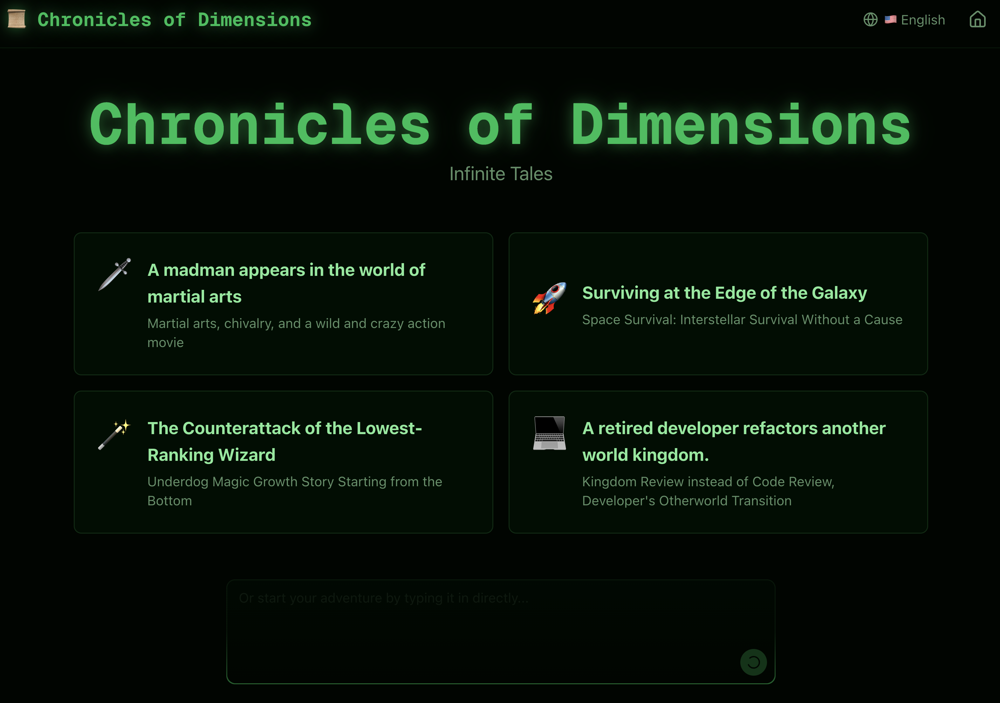

# 🎮 AI RPG Adventure

> An AI-powered text RPG game built with **Claude Agent SDK** and **Moru** cloud sandboxes.  
> _Seoul AI Builders Hackathon Project @Feb7, 2026_



## ✨ Features

- **AI Game Master** — Claude powers an intelligent game master that creates dynamic storylines, responds to player choices, and manages game state
- **Multiple World Settings** — Choose from 4 unique RPG worlds:
  - 🥋 **Murim** — Wuxia martial arts adventure with ancient temples and bamboo forests
  - 🚀 **Galactic Odyssey** — Sci-fi space opera with starships and alien planets
  - 🔮 **Arcane Academy** — Magical school with mystical creatures and glowing spells
  - ⚔️ **Chronicles of the Ancient Ring** — High fantasy with medieval castles and epic landscapes
- **AI-Generated Scene Illustrations** — Dynamic image generation for key story moments (boss encounters, new locations, dramatic events)
- **Persistent Game State** — Multi-turn conversations with session persistence via Moru Volumes
- **Real-time Chat Interface** — Modern web UI with file viewer for game assets

## 🛠️ Tech Stack

| Layer                | Technology                                                                 |
| -------------------- | -------------------------------------------------------------------------- |
| **AI Agent**         | [Claude Agent SDK](https://platform.claude.com/docs/en/agent-sdk/overview) |
| **Sandbox Runtime**  | [Moru](https://moru.io) cloud sandboxes                                    |
| **Frontend**         | Next.js 16, React 19, TailwindCSS                                          |
| **Database**         | PostgreSQL (Prisma ORM)                                                    |
| **Image Generation** | Google Gemini API                                                          |
| **Storage**          | Supabase Storage                                                           |
| **Deployment**       | Vercel                                                                     |

## 🏗️ Architecture

```
┌─────────────────┐     ┌─────────────────┐     ┌─────────────────┐
│   Next.js Web   │────▶│   Moru Sandbox  │────▶│  Claude Agent   │
│   (Vercel)      │◀────│   (Isolated)    │◀────│     SDK         │
└─────────────────┘     └─────────────────┘     └─────────────────┘
        │                       │
        ▼                       ▼
┌─────────────────┐     ┌─────────────────┐
│   PostgreSQL    │     │  Moru Volumes   │
│   (State)       │     │  (Files/Session)│
└─────────────────┘     └─────────────────┘
```

- **Web Tier**: Next.js handles UI, API routes, and database operations
- **Agent Tier**: Each game session runs in an isolated Moru sandbox with Claude Agent SDK
- **Persistence**: PostgreSQL stores conversation state; Moru Volumes persist game files and session data

## 🎯 How It Works

1. Player selects a world setting and starts a new game
2. The AI Game Master initializes the story and presents the opening scene
3. Player types actions/choices in natural language
4. Claude Agent processes input, updates game state, and generates narrative response
5. At key moments (boss fights, new areas), AI generates scene illustrations
6. Game state persists across sessions via Moru Volumes

## 👥 Team

| Name           | Role      | GitHub                                     |
| -------------- | --------- | ------------------------------------------ |
| **Duwon Kim**  | Developer | [@do1git](https://github.com/do1git)       |
| **Junbin Lee** | Developer | [@junbinlee](https://github.com/junbinlee) |

## 📚 References

- [Claude Agent SDK Documentation](https://platform.claude.com/docs/en/agent-sdk/overview)
- [Moru Documentation](https://moru.io/docs)
- [Seoul AI Builders](https://discord.gg/g5M7rqfEPY)

---

_Built at Seoul AI Builders Hackathon 2026_
